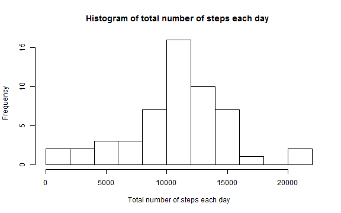
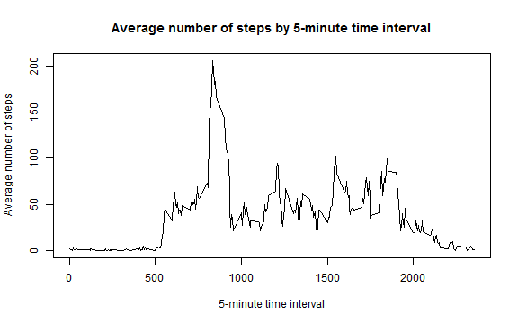
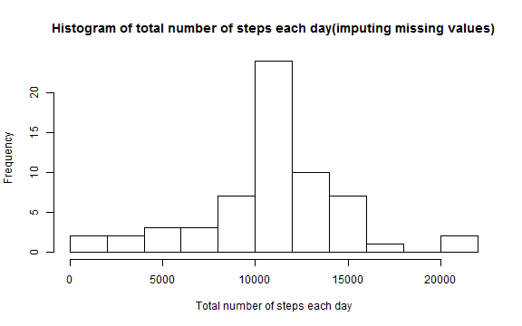
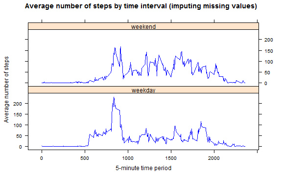

#   Reproducible Research peer Assignment 1 

## Loading and preprocessing the data


```r
a <- read.csv(file = "activity.csv")
a$date <- as.Date(a$date)
b <- a[complete.cases(a), ]
```


## What is mean total number of steps taken per day?

calculate the total number of steps each day, and draw the histogram,cacluate the mean and median total number of steps taken per day


```r
c <- tapply(b$steps, INDEX = b$date, FUN = "sum")
```


```r
hist(c, main = "Histogram of total number of steps each day ", xlab = "Total number of steps each day", 
    ylab = "Frequency ", breaks = 15)
```



```r
mean <- mean(c)
median <- median(c)
```


The mean for the total number of steps per day is **1.0766 &times; 10<sup>4</sup>**. 

The median for the total number of steps per day is **10765**.   

## What is the average daily activity pattern?

calculate the average number of steps taken, and draw the graph


```r
d <- tapply(b$steps, INDEX = b$interval, FUN = "mean")
d <- as.data.frame(d)
d <- cbind(rownames(d), d)
```


```r
plot(as.numeric(as.character(d[, 1])), d[, 2], type = "l", xlab = "5-minute time interval", 
    ylab = "Average number of steps", main = "Average number of steps by 5-minute time interval")
```



```r
max <- as.numeric(as.character(d[d[, 2] == max(d[, 2]), 1]))
NAS = dim(a)[1] - dim(b)[1]
```


The five-minute interval that contains the maximum number of average steps per day is **835**. 

## Imputing missing values

The total number of rows with NAs is **2304**.

Filling in all of the missing values with the mean for that 5-minute interval


```r
e <- a
for (i in 1:dim(e)[1]) {
    if (is.na(e$steps[i])) {
        e[i, 1] <- d[as.numeric(as.character(d[, 1])) == e[i, 3], 2]
    }
    
}
```


Draw the histogram


```r
f <- tapply(e$steps, INDEX = e$date, FUN = "sum")
```


```r
hist(f, main = "Histogram of total number of steps each day(imputing missing values)", 
    xlab = "Total number of steps each day", ylab = "Frequency ", breaks = 15)
```



```r
mean_im <- mean(f)
median_im <- median(f)
```


The mean for the total number of steps per day is **1.0766 &times; 10<sup>4</sup>**. The corresponding mean value computed based on the dataset with missing values removed was **1.0766 &times; 10<sup>4</sup>**. The median for the total number of steps per day is **1.0766 &times; 10<sup>4</sup>**. The corresponding mean value computed based on the dataset with missing values removed was **10765**. 

There is little impact of imputing missing data on the estimates of the total daily number of steps.

## Are there differences in activity patterns between weekdays and weekends?

Create a new factor variable in the dataset with two levels �C “weekday” and “weekend” 


```r
e[, 4] <- weekdays(e$date)
weekends <- e[c(e[, 4] %in% c("星期六", "星期日")), ]My operation system default languange is Chinese,'星期六'and'星期日'mean'Saturday' and'Sunday'.
weekends[, 4] <- rep("weekend", dim(weekends)[1])
weekdays <- e[!c(e[, 4] %in% c("星期六", "星期日")), ]
weekdays[, 4] <- rep("weekday", dim(weekdays)[1])
g <- tapply(weekends$steps, INDEX = weekends$interval, FUN = "mean")
g <- as.data.frame(g)
g[, 2] <- rep("weekend", dim(g)[1])
g <- cbind(rownames(g), g)
h <- tapply(weekdays$steps, INDEX = weekdays$interval, FUN = "mean")
h <- as.data.frame(h)
h[, 2] <- rep("weekday", dim(h)[1])
h <- cbind(rownames(h), h)
colnames(h) <- colnames(g)
m <- rbind(g, h)
library(lattice)
```

Draw the graph

```r
xyplot(m[, 2] ~ as.numeric(as.character(m[, 1])) | as.factor(m[, 3]), data = m, 
    type = "l", layout = c(1, 2), col = "blue", main = "Average number of steps by time interval (imputing missing values)", 
    xlab = "5-minute time period", ylab = "Average number of steps")
```



Though the maxium average number of steps by time interval of weekday is higher than that of weekend, the mean average number of steps by time interval of weekday is lower than that of weekend.
